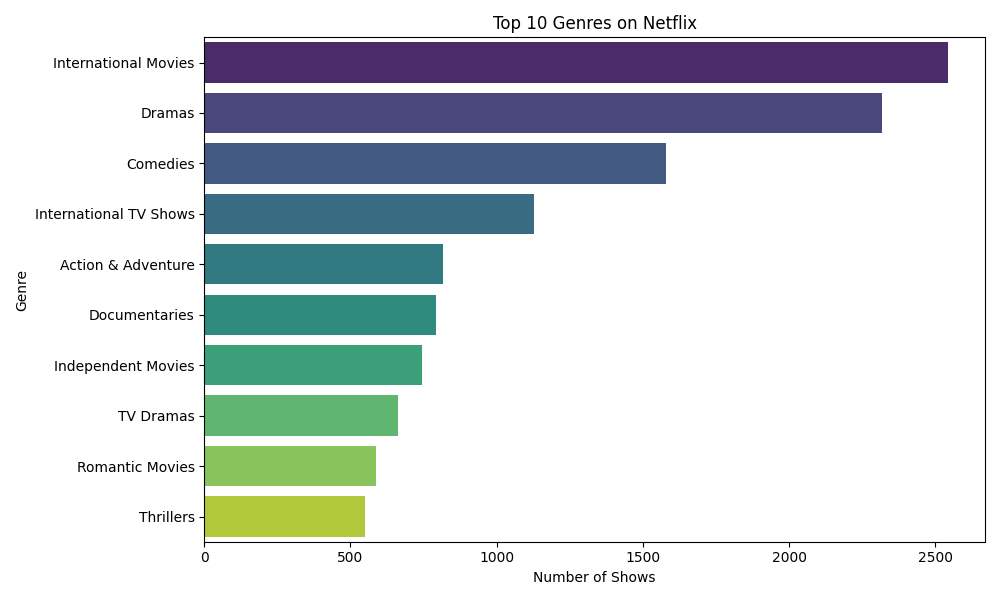
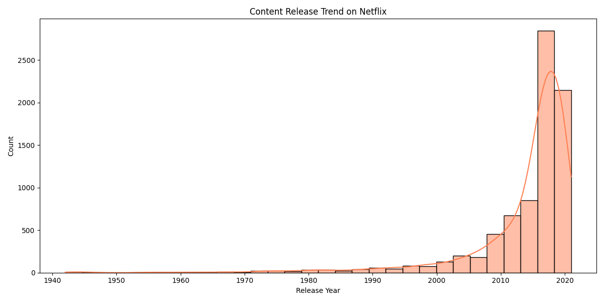
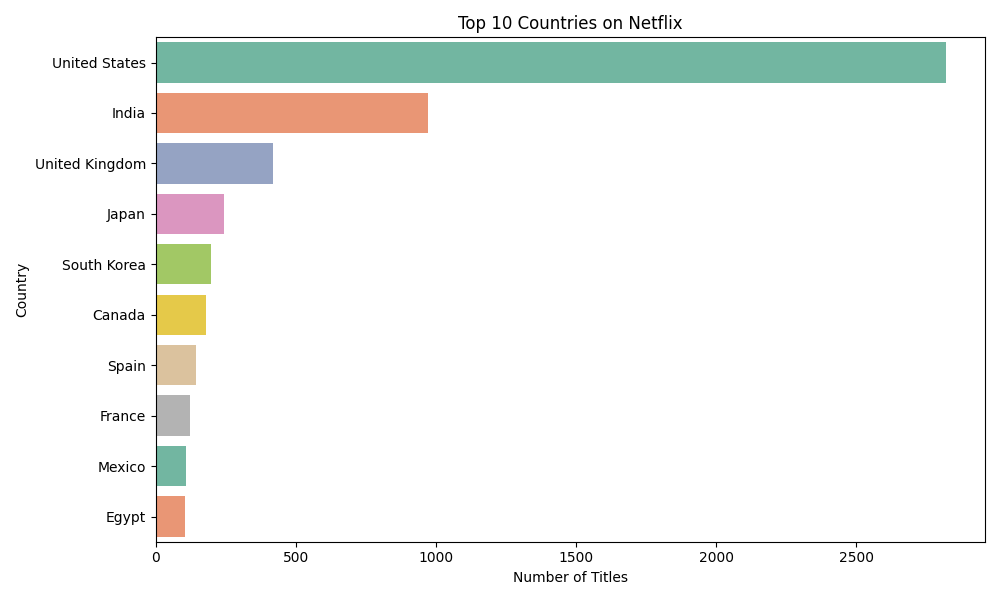

# Netflix Data Visualization

This project performs basic data visualization on the Netflix Shows dataset using Python.

## Made By Sahil Moharil

## Structure
- `utils/`: data loading & cleaning
- `visualizations/`: different types of visual plots
- `main.py`: entry script

## Run

```bash
pip install -r requirements.txt
python main.py

📌 Note:
The full dataset was excluded due to size limits. Download it from [Kaggle Netflix Dataset](https://www.kaggle.com/datasets/shivamb/netflix-shows) and replace `data/netflix_titles_sample.csv` if needed.

## 📸 Full Dataset Visualizations

### 🎭 Genre Distribution


### 📅 Release Trend


### 🌍 Country Contribution

📌 Note: The visualizations above were generated using the full Netflix dataset (available on [Kaggle](https://www.kaggle.com/datasets/shivamb/netflix-shows)).  
For repository size compliance, only a sample of 100 rows is included.
